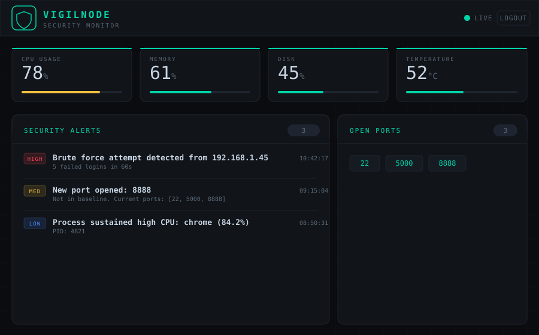

# VigilNode 🛡️

> Turn any old device into a security-aware home server.

VigilNode is a lightweight Python agent that runs on any spare laptop, Raspberry Pi, or old PC and gives you a live security monitoring dashboard — accessible from any browser on your network or the internet.

It watches your system health **and** flags suspicious activity: unusual processes, newly opened ports, and SSH brute-force attempts — then alerts you instantly via Telegram.



---

## Why VigilNode?

Most people have an old device collecting dust. Cloud monitoring tools are either expensive, privacy-invasive, or require enterprise setup. VigilNode is:

- **Lightweight** — designed to run on old hardware (1GB RAM is enough)
- **Private** — runs entirely on your own device, no data leaves your network
- **Self-hosted** — one command to start, no accounts, no subscriptions
- **Security-aware** — not just a dashboard, it actively monitors for threats

---

## Features

### 📊 System Monitoring
- Real-time CPU, RAM, disk, and temperature tracking
- Live updates via WebSockets — no page refresh needed
- Configurable alert thresholds per metric

### 🔍 Security Monitoring
- **Process detection** — flags processes running from suspicious paths (`/tmp`, `AppData`) or known bad names (cryptominers, scanners)
- **Port monitoring** — detects newly opened ports since startup
- **Brute-force detection** — parses auth logs for repeated SSH login failures

### 🔔 Alerting
- Telegram bot notifications with severity levels (HIGH / MED / LOW)
- Smart cooldown system — one alert per event per 10 minutes, no spam
- Full alert history stored locally in SQLite

### 🔐 Access Control
- Password-protected dashboard
- Session-based auth

---

## Quick Start

### Option 1 — Run directly (recommended for development)

```bash
# Clone
git clone https://github.com/BalaKrishnaS7/VigilNode.git
cd vigilnode

# Install dependencies
pip install -r requirements.txt

# Configure (Linux/macOS)
cp .env.example .env
# Configure (Windows PowerShell)
# Copy-Item .env.example .env

# Edit .env with your password and optional Telegram credentials

# Run
python run.py
```

Open `http://localhost:5000` in your browser.

---

### Option 2 — Docker

```bash
docker build -t vigilnode .
docker run -d -p 5000:5000 --env-file .env vigilnode
```

Or pull from Docker Hub *(coming soon)*:
```bash
docker run -d -p 5000:5000 yourusername/vigilnode
```

---

### Option 3 — Access from another device (same network)

Find the IP of the device running VigilNode:
```bash
# Linux/Mac
hostname -I

# Windows
ipconfig
```

Then open `http://<device-ip>:5000` from your phone or laptop.

---

### Option 4 — Access from anywhere (ngrok)

```bash
ngrok http 5000
```

Use the generated HTTPS URL to access your dashboard from anywhere.

---

## Configuration

All settings are in `.env`:

```env
# Dashboard login
DASHBOARD_USERNAME=admin
DASHBOARD_PASSWORD=yourpassword

# Telegram alerts (optional)
TELEGRAM_BOT_TOKEN=your_bot_token
TELEGRAM_CHAT_ID=your_chat_id

# Thresholds
CPU_ALERT_THRESHOLD=85
RAM_ALERT_THRESHOLD=90
DISK_ALERT_THRESHOLD=95
TEMP_ALERT_THRESHOLD=80

# Security
FAILED_LOGIN_THRESHOLD=5     # failed SSH attempts before alert
FAILED_LOGIN_WINDOW=60       # seconds to count attempts in
ALERT_COOLDOWN=600           # seconds between same alert type
```

### Setting up Telegram alerts

1. Message `@BotFather` on Telegram → create a new bot → copy the token
2. Message `@userinfobot` on Telegram → copy your chat ID
3. Paste both into `.env`

---

## How It Works

VigilNode runs three background threads alongside the Flask web server:

```
┌─────────────────────────────────────────────────────┐
│                     VigilNode                       │
│                                                     │
│  Thread 1 — System Monitor (every 2s)               │
│    psutil → CPU/RAM/disk/temp → WebSocket push      │
│                                                     │
│  Thread 2 — Security Monitor (every 10s)            │
│    Process scan + Port scan + Auth log parse        │
│                          │                          │
│                          ▼                          │
│  Thread 3 — Alert Engine                            │
│    Cooldown check → SQLite → Telegram               │
└─────────────────────────────────────────────────────┘
```

The Flask dashboard receives live stats via WebSockets (Flask-SocketIO), so the browser updates without polling.
Current runtime mode uses Flask-SocketIO `threading` async mode for Python 3.14 compatibility.

---

## OS Support

| OS | System Stats | Process Monitor | Port Monitor | Auth Log |
|---|---|---|---|---|
| Linux (Ubuntu/Debian) | ✅ | ✅ | ✅ | ✅ `/var/log/auth.log` |
| Linux (RHEL/CentOS) | ✅ | ✅ | ✅ | ✅ `/var/log/secure` |
| macOS | ✅ | ✅ | ✅ | ✅ `/var/log/system.log` |
| Windows | ✅ | ✅ | ✅ | ⚠️ Event Log (partial) |
| Raspberry Pi | ✅ | ✅ | ✅ | ✅ |

---

## Tech Stack

| Component | Technology | Why |
|---|---|---|
| Backend | Python, Flask | Lightweight, low memory, runs on old hardware |
| Real-time | Flask-SocketIO (threading mode) | Push updates without polling |
| System data | psutil | Cross-platform, all-in-one |
| Database | SQLite | Zero setup, file-based, no separate server |
| Alerts | Telegram Bot API | Free, reliable, works on any phone |
| Container | Docker | Easy deployment anywhere |

---

## Project Structure

```
vigilnode/
├── run.py                  # Entry point — starts Flask + 3 monitor threads
├── config.py               # All settings loaded from .env
├── requirements.txt
├── Dockerfile
├── .env.example
├── docs/
│   └── dashboard-preview.svg
├── tests/
│   ├── __init__.py
│   ├── test_alerts.py
│   ├── test_auth_log.py
│   ├── test_config.py
│   └── test_process.py
└── app/
    ├── __init__.py         # Flask app factory + SocketIO init
    ├── routes.py           # Dashboard, login/logout, REST API
    ├── database.py         # SQLite — alerts table + cooldown logic
    ├── monitors/
    │   ├── system.py       # CPU, RAM, disk, temperature
    │   ├── process.py      # Suspicious process detection
    │   ├── network.py      # Open port monitoring
    │   └── auth_log.py     # SSH brute-force detection
    ├── alerts/
    │   ├── engine.py       # Central alert handler + spam prevention
    │   └── telegram.py     # Telegram bot sender
    └── templates/
        ├── login.html      # Auth page
        └── dashboard.html  # Live monitoring dashboard
```

---

## Designed for Old Hardware

VigilNode is deliberately minimal:

- No ML models, no heavy dependencies
- SQLite instead of a database server
- WebSocket push instead of constant HTTP polling
- Background threads are lightweight — not spinning unnecessarily
- Tested on a device with 1.5GB RAM

---

## Roadmap (v2 ideas)

- [ ] Multi-device support — run agents on multiple devices, central dashboard
- [ ] Email alerts as alternative to Telegram
- [ ] Windows Event Log parsing for brute-force detection
- [ ] CPU/RAM usage graphs (historical data)
- [ ] Custom process watchlist via dashboard UI
- [ ] Mobile-optimized dashboard

---

## License

MIT License — free to use, modify, and distribute.

---

*Built with Python. Runs on anything. Watches everything.*
